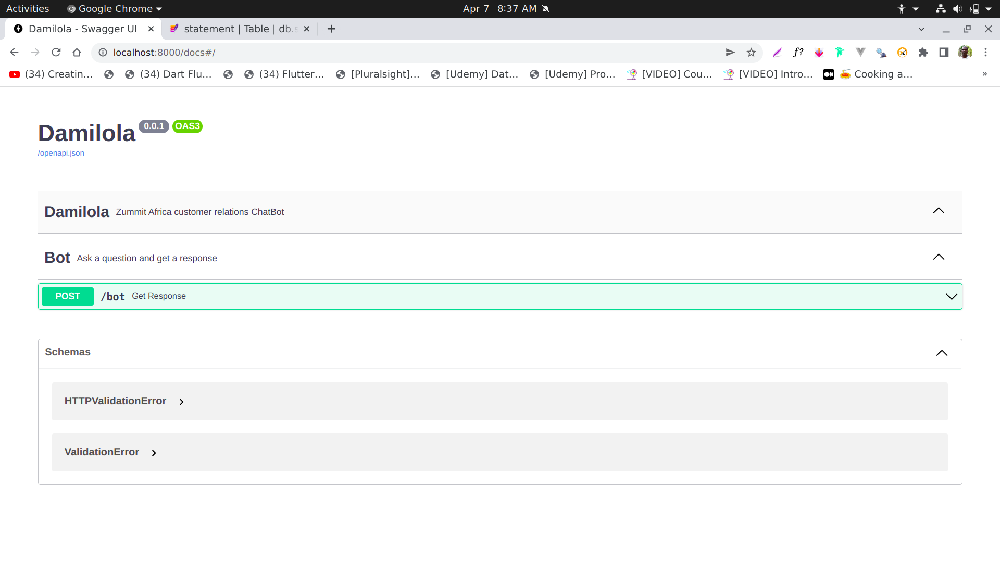

# Damiloa Bot



> Chatbot API build with FastAPI and ChatterBot


## To Run the API 

1. Create a virtualenv 
   ```bash
   python3 -m venv bot 
   ```
   then activate the env
2. ```bash
    bot\bin\activate
   ```
3. Install dependencies from the `requirements.txt` file
    ```bash
    pip install -r requirements.txt
    ```
4. Finaly, run the API with the command:
    ```bash
        uvicorn app:app --reload
    ```